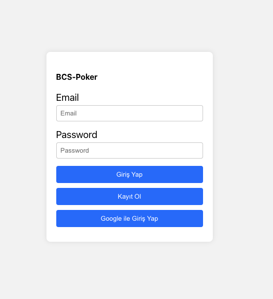

# BCS Poker Planning

## Overview
BCS Poker Planning is a real-time, collaborative, and interactive application designed to facilitate agile poker planning sessions. This tool enables teams to estimate their work items efficiently and remotely, providing an intuitive interface for all participants.

## Beta Version Disclaimer
:warning: **Please note that BCS Poker Planning is currently in beta.** While I have done our best to ensure a smooth user experience, there may be unforeseen issues or incomplete features. I appreciate your understanding and welcome any feedback or reports of issues to help us improve the application.

## Technologies Used
- React
- Firebase (Authentication and Realtime Database)
- CSS

## Setup and Installation
1. Clone the repository: `git clone https://github.com/abdurrahmanbulut/bcs-poker.git`
2. Install the dependencies: `npm install`
3. Start the application: `npm start`
4. Visit `http://localhost:3000` in your browser.

## Features
- **Real-Time Collaboration:** All changes are reflected in real time for every participant in the session.
- **User Authentication:** Secure user authentication to keep your planning sessions private.
- **Interactive Card Selection:** Participants can select and change their estimates until the session is finalized.
- **Instant Result Calculation:** The application calculates the average of selected numbers instantly when the cards are revealed.

## How to Use
1. **Login/Signup:** Start by creating an account or logging in.
2. **Join a Session:** Enter the planning session with your team.
3. **Select a Card:** Choose your estimate for the work item being discussed.
4. **Reveal Cards:** Once everyone has made their selection, reveal all the cards.
5. **Reset and Repeat:** After discussing the estimates, reset the selections for the next item.

## Screenshots

## Contributing
Contributions are welcome! Please feel free to submit a Pull Request.

## License
This project is licensed under the MIT License

## Acknowledgments
- Thanks to everyone who contributed to this project!

